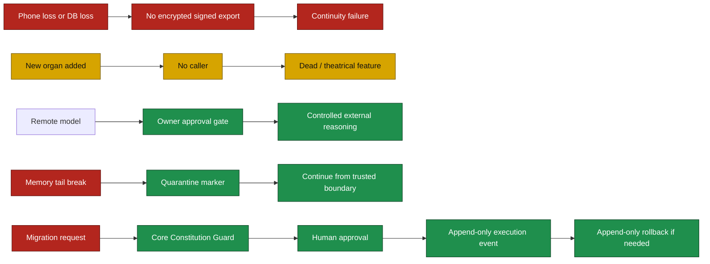

# Morimil Obsidian-Style Organ Map

This file is separate from `docs/ARCHITECTURE_MAP.md`. Do not merge this into the architecture map. This is a visual operating map for quickly seeing which organs are connected, which are in review, and which are critical.

Obsidian-style rule: this document uses graph thinking. Nodes are organs. Edges are runtime dependencies. Colors show health status.

## Legend

| Color | Status | Meaning |
|---|---|---|
| Green | Healthy / connected | Organ has file, caller, composition root or runtime path, and current build does not fail. |
| Yellow | Review / paused | Organ exists or is partially registered, but needs deeper audit, enforcement, or next implementation before autonomy increases. |
| Red | Critical gap | Missing survival/security capability or unresolved high-blast-radius risk. |

## Global graph

```mermaid
graph TD
    APP[Android App Entry] --> ROOT[MorimilApp Root UI]
    ROOT --> TABS[Main Tabs Scaffold]

    TABS --> CHAT[Chat Screen]
    TABS --> MOTOR[Motor Screen]
    TABS --> GENESIS[Genesis Screen]
    TABS --> MEMORY_UI[Memory Screen]
    TABS --> IMPROVE_UI[Improvements Screen]
    TABS --> PC_UI[PC Handoff Screen]
    TABS --> PROJECTS_UI[Projects Screen]

    ROOT --> VM[MorimilViewModel]
    VM --> CONTAINER[MorimilAppContainer]

    CONTAINER --> MEMORY_DB[MorimilDatabase]
    CONTAINER --> ORGAN_DB[MemoryOrganDatabase]
    CONTAINER --> SIGNER[Memory Event Signer]
    CONTAINER --> INTEGRITY[Memory Integrity Core]
    CONTAINER --> MEMORY_REPO[Memory Repository]
    CONTAINER --> ORGAN_REPO[Memory Organ Repository]
    CONTAINER --> LINK_REPO[Memory Link Repository]
    CONTAINER --> REST_REPO[Rest Cycle Repository]
    CONTAINER --> RECALL_REPO[Recall Schedule Repository]
    CONTAINER --> MIGRATION_REPO[Cognitive Migration Repository]
    CONTAINER --> GENESIS_READER[Genesis Reader]
    CONTAINER --> SECRET_VAULT[Secret Vault]
    CONTAINER --> KERNEL[Reasoning Kernel]
    CONTAINER --> PROJECT_VAULT[Project Vault Repository]
    CONTAINER --> AGENT_ORCH[Agent Orchestration Repository]

    CHAT --> KERNEL
    MOTOR --> SECRET_VAULT
    MEMORY_UI --> MEMORY_REPO
    MEMORY_UI --> REST_REPO
    MEMORY_UI --> RECALL_REPO
    MEMORY_UI --> MIGRATION_REPO
    IMPROVE_UI --> IMPROVE_STORE[Improvement Proposal Store]

    KERNEL --> MEMORY_REPO
    KERNEL --> ORGAN_REPO
    KERNEL --> LINK_REPO
    KERNEL --> REST_REPO
    KERNEL --> RECALL_REPO
    KERNEL --> MODEL_ROUTER[Model Backend Router]
    MODEL_ROUTER --> LOCAL_FALLBACK[Deterministic Fallback]
    MODEL_ROUTER --> REMOTE_API[Remote API Slot]

    MEMORY_REPO --> SIGNER
    MEMORY_REPO --> INTEGRITY
    MEMORY_REPO --> QUARANTINE[Memory Integrity Quarantine]
    ORGAN_REPO --> INTEGRITY
    REST_REPO --> INTEGRITY
    REST_REPO --> LINK_REPO
    REST_REPO --> AUTOBIO[Autobiographical Snapshot]
    REST_WORKER[Rest Cycle Worker] --> REST_REPO
    RECALL_REPO --> LINK_REPO
    MIGRATION_REPO --> MIGRATION_RECORDS[Migration Records]
    MIGRATION_REPO --> CONSTITUTION[Core Constitution Guard]
    CONSTITUTION --> GENESIS_CORE_LOCK[Genesis Core Immutable]

    MEMORY_REPO --> EXPORT_GAP[Encrypted Signed Export / Restore]
    PC_UI --> PC_EXECUTOR[PC Executor Automation Boundary]
    PROJECTS_UI --> PROJECT_VAULT
    PROJECTS_UI --> AGENT_ORCH
    KERNEL --> ON_DEVICE_MODEL[On-device Runtime]

    classDef healthy fill:#1f8f4d,stroke:#0b3d20,color:#ffffff;
    classDef review fill:#d6a400,stroke:#6b5200,color:#111111;
    classDef critical fill:#b3261e,stroke:#5c0f0b,color:#ffffff;

    class APP,ROOT,TABS,CHAT,MOTOR,GENESIS,MEMORY_UI,IMPROVE_UI,VM,CONTAINER,MEMORY_DB,ORGAN_DB,SIGNER,INTEGRITY,MEMORY_REPO,ORGAN_REPO,LINK_REPO,REST_REPO,RECALL_REPO,MIGRATION_REPO,GENESIS_READER,SECRET_VAULT,KERNEL,IMPROVE_STORE,MODEL_ROUTER,LOCAL_FALLBACK,REMOTE_API,QUARANTINE,AUTOBIO,REST_WORKER,MIGRATION_RECORDS,CONSTITUTION,GENESIS_CORE_LOCK healthy;
    class PC_UI,PROJECTS_UI,PROJECT_VAULT,AGENT_ORCH,ON_DEVICE_MODEL review;
    class EXPORT_GAP,PC_EXECUTOR critical;
```

## Status board

| Organ | Status | Why | Next control |
|---|---|---|---|
| Android entry / root UI | Green | `MainActivity -> MorimilApp -> MainTabsScaffold` is connected. | Keep stable. |
| Tabs navigation | Green | Chat, Motor, Genesis, Workspace, Projects, Memory, PC, Mejoras are routed. | Avoid adding tabs without organ map update. |
| Local Genesis birth | Green | Birth flow installs Genesis bundle, checks manifest hash, creates local identity and Genesis Core. | Add restore-aware birth protection after export exists. |
| Living memory chain | Green | Hash-linked and signed append path exists with snapshot rebuild. | Keep append-only; test corruption/quarantine. |
| Memory signer / epoch | Green | Signer is injected through composition root. | Later: move epoch trust boundary beyond SharedPreferences if threat model requires stronger local tamper resistance. |
| Memory integrity quarantine | Green | Tail integrity break inserts quarantine marker and continues from trusted boundary. | Add UI warning severity if quarantine exists. |
| Knowledge capsules | Green | Explicit capsule intake and chain verification exist. | Improve classifier precision later. |
| Memory links / graph substrate | Green | Links connect capsules, rest cycles, recall schedules and memory events. | Add visual graph canvas in app later. |
| Reasoning kernel | Green | Runtime builds context, routes backend, records trace, uses fallback if blocked/unavailable. | Add stronger trace audit screen. |
| Remote API escalation | Green | Superior runtime requires approval gate. | Keep no automatic remote escalation. |
| Rest cycle runtime | Green | Startup, manual and WorkManager routes exist. | Test scheduled status on real device after idle. |
| Recall schedule | Green | Seeds from important memory and supports reinforce/postpone/degrade. | Add overdue status badge if not already visible. |
| Cognitive migration | Green | Plan, approve, execute and rollback flow exists; execution requires approved state. | Add rate limit and pending-count enforcement if not already tested end-to-end. |
| Core constitution guard | Green | Blocks Genesis Core mutation and gates doctrine/policy migration controls. | Add unit tests for deny/review/allow branches. |
| Improvements governance | Green | Signals create proposals; decisions persist to Room audit; approved plan does not execute automatically. | Add link from approved plan to exact files/checks in future. |
| Secret vault | Green | Runtime reads key from vault path, not from memory context. | Audit traces/logs for accidental key leakage. |
| Project Vault | Yellow | Registered and routed, but not fully audited in this map. | Deep audit caller, state transitions, archive/complete path. |
| Agent Orchestration | Yellow | Registered and seeded, but needs stronger execution boundary audit. | Confirm no external/irreversible action without owner approval. |
| PC Handoff UI | Yellow | UI exists, but repo states PC executor automation is not included. | Keep as handoff until explicit executor boundary exists. |
| On-device runtime | Yellow | Strategic target, but should wait. | Do not start before export/reincarnation is secure. |
| Encrypted signed export / restore | Red | Continuity risk: phone loss can destroy Morimil memory. | P0 implementation target. |
| PC executor automation | Red | Not included; high blast radius if rushed. | Design approval-gated, read-only-by-default boundary after export. |

## Failure map

## Obsidian backlink index

Use these tags and links if this file is opened inside an Obsidian vault:

- #morimil/status/green
- #morimil/status/yellow
- #morimil/status/red
- #morimil/organ/memory
- #morimil/organ/reasoning
- #morimil/organ/migration
- #morimil/organ/export
- #morimil/organ/pc_executor

Linked nodes:

- [[Morimil Root UI]] -> [[MorimilViewModel]] -> [[MorimilAppContainer]]
- [[MorimilAppContainer]] -> [[Living Memory Chain]]
- [[Living Memory Chain]] -> [[Memory Integrity Core]] -> [[Memory Integrity Quarantine]]
- [[Reasoning Kernel]] -> [[Model Backend Router]] -> [[Remote API Escalation Gate]]
- [[Reasoning Kernel]] -> [[Deterministic Fallback]]
- [[Rest Cycle Runtime]] -> [[Autobiographical Snapshot]] -> [[Memory Links]]
- [[Recall Schedule Runtime]] -> [[Memory Links]]
- [[Cognitive Migration]] -> [[Core Constitution Guard]] -> [[Genesis Core Immutable]]
- [[Improvements Governance]] -> [[Room Decision Audit]]
- [[Secret Vault]] -> [[Reasoning Credentials]]
- [[Encrypted Signed Export Restore]] -> [[Continuity Protection]]
- [[PC Executor Boundary]] -> [[External Effects Approval]]

## How to improve this next

1. Add a real in-app graph screen using the same status model.
2. Store organ health as data, not only docs.
3. Add an automated check that fails PRs when a new repository/use case/screen is added without a map entry.
4. Add health sources:
   - build status,
   - memory audit result,
   - capsule audit result,
   - WorkManager rest-cycle state,
   - latest internal runtime issue,
   - pending migration count,
   - quarantine presence.
5. Promote this map from static doc to runtime dashboard only after export/reincarnation is implemented.

## Immediate interpretation

The system is mostly green in local memory, governance and reasoning routing. The red zone is not intelligence. The red zone is survival: encrypted signed export and restore. Do not expand autonomy before solving that.
